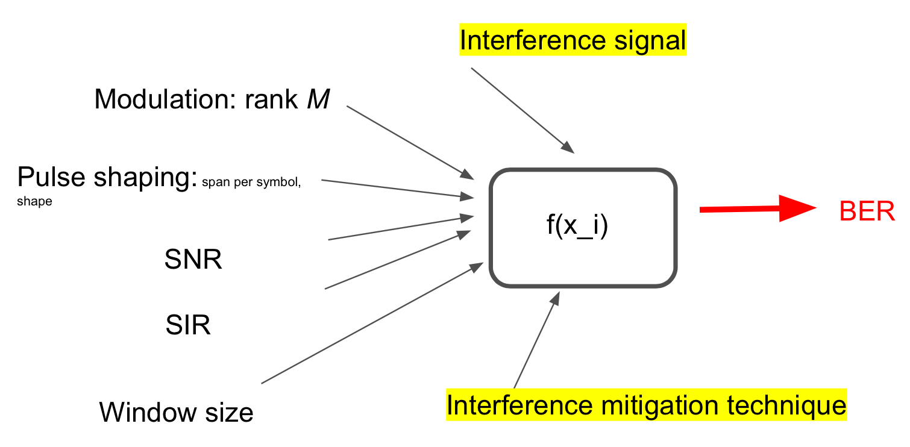

# Bit-Error-Rate (BER) Predict using Neural Network

Aug, 2019    
Jet Yu, jianyuan@vt.edu  
Hussein Metwaly Saad, husseinm19@vt.edu     
Yue Xu, xuyue24@vt.edu    
Mike Buehrer, rbuehrer@vt.edu   
__Wireless, ECE, Virginia Tech__  

# Dataset
under folder `DATA`, for more data, click [DataSet](https://drive.google.com/drive/folders/1SEYScWxg7xViXz1snsuuhOBDKR7r1Npt?usp=sharing), and `./DATA/READ.md` describe the data. 

# How to run
* if need, run `./FUNCTION/mainGenerateData.m` to generate dataset
* `main_regression.py`, where labels are in [0,1] scale  
* `main_regression_dB.py`, where labels are in log scale, [0, 40]dB
* `main_classification.py`, where labels are in another log scale

# File Description
* `ToolBox.py` is called by `main_classification.py`.  
* Under `FUNCTIONS` run `mainGenerateData.m` to generate traing dataset.  
* `Result` folder has  all trained results when run `main*.py` file
* `Predict` folder has  all test results when run `test.py`

  

# Chat/ Hangout Group
[Chat/ Hangout Group](https://chat.google.com/dm/5UaasgAAAAE)

# Slides
[performance Google slides](https://docs.google.com/presentation/d/1wvBJu3MCXwSCdlEYCqtS8yEkW09xzvSyF3J_e1V8rkM/edit?usp=sharing)

# News
(Sep 29) starter code online

# Roadmap

# Config
running on ARC VT is prefered, run python is preferred.
 * Matlab 
   * Machine Learning Toolbox  
   * GPU optional
 * Python
   * tensorflow, Keras, scikitlearn  

# Running Time Reference

