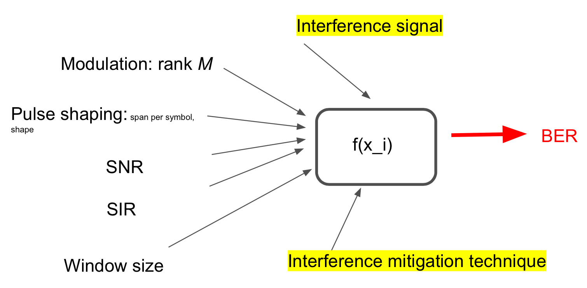

# BerPredict

Bit-Error-Rate (BER) Predict using Neural Networkin Matlab  
Aug, 2019    
Jet Yu   
jianyuan@vt.edu    
Wireless, ECE, Virginia Tech 

# Slides
[performance Google slides]([TODO](https://docs.google.com/presentation/d/1wvBJu3MCXwSCdlEYCqtS8yEkW09xzvSyF3J_e1V8rkM/edit?usp=sharing))

# News
(Sep 29) starter code online

# Roadmap

# Config
running on ARC VT is prefered. 
 * Matlab 
   * Machine Learning Toolbox  
   * GPU optional

# How to run
* `BerPred.m` to generate dataset
* `estFitnet.m` to training and testing
  
# Dataset Description
* `X1.mat` `Y1.mat`, FFT_Threshold, `Ndat` 2000, `N` number of bits 1e4
* `X2.mat` `Y2.mat`, DSSS, `Ndat` 2000, `N` number of bits 1e4   
* `X3.mat` `Y3.mat`, DSSS, `Ndat` 2000, `N` number of bits 1e4 
*  `X1_n.mat` `Y1_n.mat`, FFT_Threshold, AWGN only, `Ndat` approxi 400, `N` number of bits 1e4  
*  `XLong1.mat` `YLong1.mat`, FFT_Threshold, `Ndat` 2000, `N` number of bits __1e5__
*  `XLong3.mat` `YLong3.mat`, Notch, `Ndat` 2000, `N` number of bits __1e5__
*  `XScale1.mat` `YScale1.mat`, FFT_Threshold, `Ndat` __20000__, `N` number of bits 1e4

# Running Time Reference

